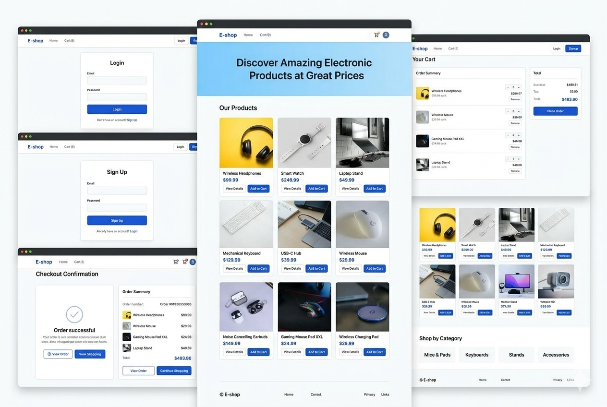

# E-Shop — Electronics E-Commerce (React)



A modern, responsive electronics storefront built with React and Vite. Browse products, manage a shopping cart, place orders, and sign up / log in — all client-side with a clean UI.

**Live:** [E-Shop](https://electronics-ecommerce-react.vercel.app/)

---

## Features

- **Product catalog** — Browse a curated list of electronic products with images, prices, and descriptions
- **Product details** — Dedicated page for each item with full description and add-to-cart
- **Shopping cart** — Add items, update quantities, remove products, and see live totals
- **Checkout** — Order summary with subtotal, tax, and place-order flow (success modal)
- **Authentication** — Sign up and login with email/password validation (React Hook Form)
- **Responsive design** — Works on desktop, tablet, and mobile
- **Sticky navbar** — Brand, navigation, cart count, and auth controls always available

---

## Tech Stack

| Layer   | Tools                                 |
| ------- | ------------------------------------- |
| UI      | React 19                              |
| Build   | Vite 8                                |
| Routing | React Router DOM 7                    |
| Forms   | React Hook Form                       |
| State   | React Context API (Auth + Cart)       |
| Styling | Custom CSS (modern e-commerce design) |

---

## Getting Started

### Prerequisites

- Node.js 18+ (recommended)
- npm (or yarn / pnpm)

### Install & run

```bash
# clone the repo
git clone https://github.com/Souravbanerjeedata/electronics-ecommerce-react.git
cd electronics-ecommerce-react

# install dependencies
npm install

# start development server
npm run dev
```

Open [http://localhost:5173](http://localhost:5173) in your browser.

### Other scripts

```bash
npm run build    # production build
npm run preview  # preview production build locally
npm run lint     # run ESLint
```

---

## Project Structure

```
src/
├── components/
│   ├── Navbar.jsx          # Sticky header with cart count & auth
│   └── ProductCard.jsx     # Product card for the grid
├── context/
│   ├── AuthContext.jsx     # Signup / login / logout
│   └── CartContext.jsx     # Cart state, quantities, totals
├── data/
│   └── products.js         # Product catalog (static data)
├── pages/
│   ├── Home.jsx            # Hero + product grid
│   ├── ProductDetails.jsx  # Single product view
│   ├── Checkout.jsx        # Cart & order summary
│   └── Auth.jsx            # Login / Sign up form
├── App.jsx                 # Routes & providers
├── App.css                 # Global styles
└── main.jsx                # Entry point
```

---

## How It Works

### Authentication

- Users can **Sign Up** or **Login** with email and password
- Form validation (required fields, password length 6–12 characters)
- Auth state is held in `AuthContext` and reflected in the navbar

### Cart

- Add products from the home grid or product details page
- Quantity controls and remove on the checkout page
- Cart count appears in the navbar
- Place Order clears the cart and shows a success modal

### Products

- Data lives in `src/data/products.js` (id, name, price, image, description)
- Images are loaded from Unsplash

---

## Future Improvements (ideas)

- Persist cart & auth in `localStorage`
- Connect to a real backend / API
- Product search and category filters
- Order history for logged-in users
- Payment integration

---

## License

This project is open source and available under the [MIT License](LICENSE).

---

Built with React + Vite.
